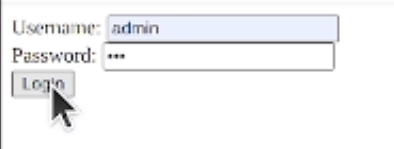
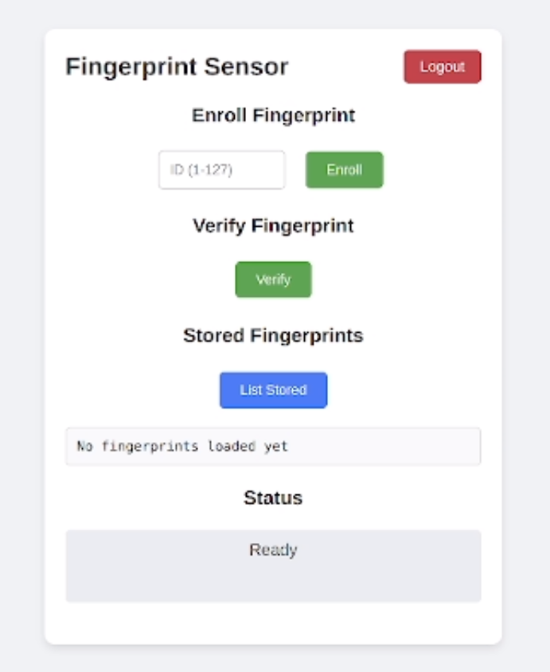
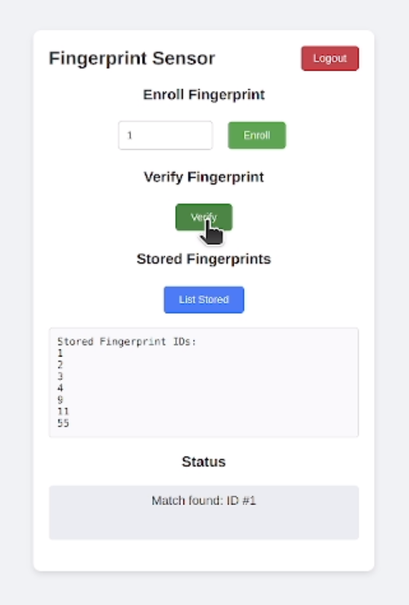

# ESP32 Fingerprint Web App

## Overview
This project implements a web-based fingerprint authentication system using an ESP32 microcontroller and an Adafruit-compatible fingerprint sensor (e.g., R307 or similar). The ESP32 hosts a web server that allows users to enroll, verify, and list fingerprints through a browser interface. The system includes basic authentication to secure access to the web interface.

## Features
- **Fingerprint Enrollment**: Register new fingerprints with IDs (1-127).
- **Fingerprint Verification**: Check if a scanned fingerprint matches stored records.
- **List Stored Fingerprints**: Display IDs of all enrolled fingerprints.
- **Secure Web Interface**: Requires login with username and password.
- **WiFi Connectivity**: Connects to a local WiFi network to serve the web interface.
- **Responsive Design**: Simple, user-friendly HTML interface with CSS styling.

## Hardware Requirements
- **ESP32 Development Board** (e.g., ESP32-WROOM-32)
- **Fingerprint Sensor** (Adafruit-compatible, e.g., R307, connected via UART)
- **WiFi Network** (with known SSID and password)
- **Computer** (for programming the ESP32 and accessing the web interface)
- **USB Cable** (for programming and debugging)
- **Optional**: 3D-printed enclosure (STL files provided in the repository)

## Software Requirements
- **Arduino IDE** or **PlatformIO** with ESP32 support
- **Libraries**:
  - `WiFi.h` (included with ESP32 Arduino core)
  - `WebServer.h` (included with ESP32 Arduino core)
  - `Adafruit_Fingerprint.h` (install via Arduino Library Manager or GitHub)
- **Serial Monitor** (for debugging, set to 115200 baud)

## Hardware Setup
1. **Connections**:
   - Connect the fingerprint sensor to the ESP32:
     - **RX** (sensor) to **GPIO 16** (ESP32)
     - **TX** (sensor) to **GPIO 17** (ESP32)
     - **VCC** to 3.3V or 5V (check sensor specifications)
     - **GND** to GND
   - Ensure proper power supply and secure connections.
   - Optionally, use the provided STL files to 3D print an enclosure for the ESP32 and sensor.

     
     *Figure 1: Physical setup of ESP32 and fingerprint sensor*

2. **Verify Setup**:
   - After uploading the code, check the Serial Monitor (115200 baud) for:
     - WiFi connection status and IP address.
     - Fingerprint sensor detection and parameters.
   - If the sensor is not detected, verify connections and power supply.

## Software Setup
1. **Configure WiFi**:
   - Update the `ssid` and `password` variables in the code with your WiFi credentials:
     ```cpp
     const char* ssid = "your_wifi_ssid";
     const char* password = "your_wifi_password";
     ```

2. **Configure Web Credentials**:
   - Set the web interface username and password:
     ```cpp
     const char* www_username = "admin";
     const char* www_password = "123";
     ```
   - Change these for better security in a production environment.

3. **Install Libraries**:
   - Install the `Adafruit_Fingerprint` library via the Arduino Library Manager or download from [GitHub](https://github.com/adafruit/Adafruit-Fingerprint-Sensor-Library).
   - Ensure the ESP32 Arduino core is installed (follow [ESP32 Arduino setup guide](https://docs.espressif.com/projects/arduino-esp32/en/latest/installing.html)).

4. **Upload Code**:
   - Connect the ESP32 to your computer via USB.
   - Open the code in Arduino IDE or PlatformIO.
   - Select the correct board (e.g., "ESP32 Dev Module") and port.
   - Upload the code to the ESP32.

## Usage
1. **Access the Web Interface**:
   - Navigate to the ESP32's IP address (displayed in the Serial Monitor) in a browser.
   - Log in using the credentials (`admin`/`123` by default). The login page is shown below:

     
     *Figure 2: Login page for the web interface*

2. **Main Interface**:
   - After logging in, you'll see the main interface for managing fingerprints:

     
     
     *Figure 3: Main web interface for fingerprint enrollment, verification, and listing*

3. **Enroll a Fingerprint**:
   - In the "Enroll Fingerprint" section, enter an ID (1-127).
   - Click "Enroll" and follow the prompts to scan the same finger twice.
   - The status will update to indicate success or failure.

4. **Verify a Fingerprint**:
   - Click the "Verify" button in the "Verify Fingerprint" section.
   - Place a finger on the sensor.
   - The status will show if a match is found or not.

5. **List Stored Fingerprints**:
   - Click "List Stored" to display the IDs of all enrolled fingerprints in the "Stored Fingerprints" section.

6. **Logout**:
   - Click the "Logout" button to end the session and return to the login page.

## Web Interface
- **Login Page**: Enter username and password to access the main interface (see Figure 2).
- **Main Interface** (see Figure 3):
  - **Enroll Section**: Input field for ID and button to start enrollment.
  - **Verify Section**: Button to initiate fingerprint verification.
  - **List Section**: Button to list all stored fingerprint IDs.
  - **Status Section**: Displays real-time feedback for operations.
  - **Logout Button**: Located in the header for session termination.

## Code Structure
- **Libraries**:
  - `WiFi.h`: Handles WiFi connectivity.
  - `WebServer.h`: Manages HTTP server and routes.
  - `Adafruit_Fingerprint.h`: Interfaces with the fingerprint sensor.
  - `HardwareSerial.h`: Configures UART for sensor communication.
- **Key Functions**:
  - `setup()`: Initializes Serial, WiFi, fingerprint sensor, and web server.
  - `loop()`: Handles web server client requests.
  - `handleRoot()`: Serves the main web interface (HTML/CSS/JS).
  - `handleLogin()` and `handleLoginPost()`: Manage user authentication.
  - `handleEnroll()`: Processes fingerprint enrollment requests.
  - `handleVerify()`: Verifies fingerprints against stored records.
  - `handleList()`: Lists stored fingerprint IDs.
  - `getFingerprintEnroll()`: Enrolls a new fingerprint with two scans.
  - `getFingerprintID()`: Verifies a fingerprint with a 10-second timeout.
  - `base64_encode()` and `base64_decode()`: Handle authentication data encoding/decoding.

## 3D Printing
- STL files for a custom enclosure are included in the repository.
- Use these files to 3D print a housing for the ESP32 and fingerprint sensor.
- Ensure proper alignment for sensor access and USB port for programming.

## Security Notes
- **Default Credentials**: Change `www_username` and `www_password` for better security.
- **Session Management**: Uses cookies (`ESPSESSIONID`) for authentication. Ensure HTTPS in production for secure communication.
- **WiFi Security**: Use a secure WiFi network to prevent unauthorized access.

## Troubleshooting
- **Sensor Not Detected**: Check UART connections (RX/TX) and power supply. Ensure the correct baud rate (57600).
- **WiFi Connection Fails**: Verify SSID and password. Check WiFi signal strength.
- **Web Interface Inaccessible**: Confirm the ESP32's IP address and ensure the device is on the same network.
- **Enrollment/Verification Errors**: Ensure the finger is clean and properly placed. Check Serial Monitor for detailed error messages.

## Limitations
- **Fingerprint Storage**: Limited to 127 fingerprints (sensor capacity).
- **Timeout**: Verification times out after 10 seconds if no finger is detected.
- **Security**: Basic authentication; consider adding HTTPS for production use.
- **No Persistence**: Fingerprint data is stored in the sensor's flash memory, but session data is not persistent across reboots.

## Future Improvements
- Add HTTPS support for secure communication.
- Implement fingerprint deletion functionality.
- Add a database for user management and fingerprint metadata.
- Enhance UI with more detailed status messages and animations.
- Add support for multiple fingerprint sensors.

## License
This project is licensed under the MIT License. See the [LICENSE](LICENSE) file for details.

## Acknowledgments
- Built using the [Adafruit Fingerprint Sensor Library](https://github.com/adafruit/Adafruit-Fingerprint-Sensor-Library).
- Inspired by ESP32 web server examples from the Arduino community.
